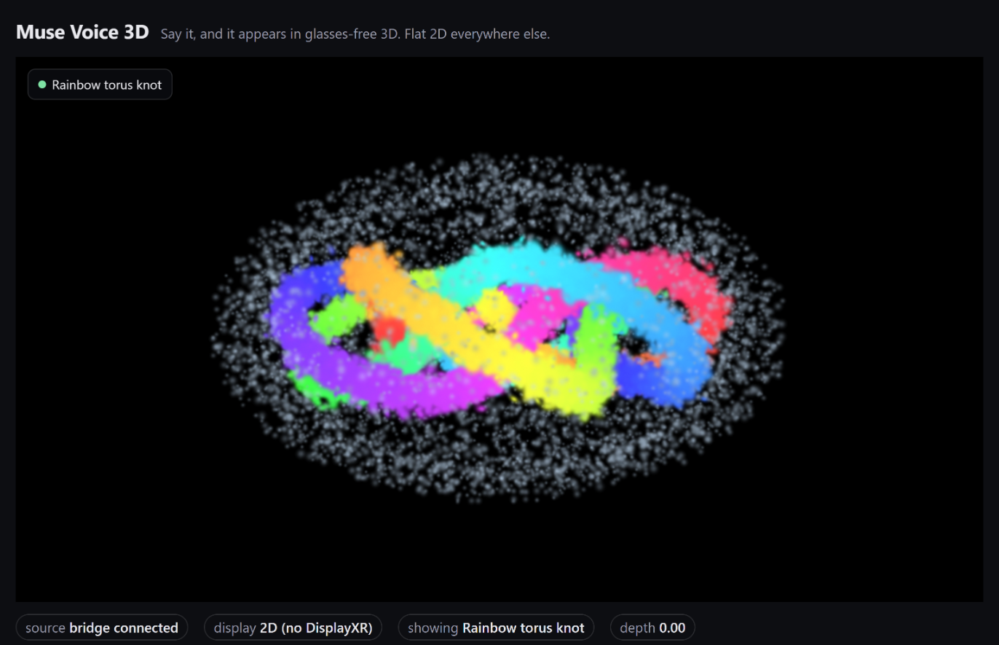
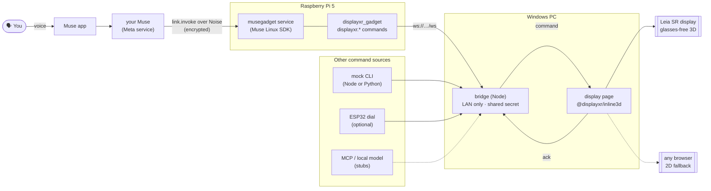

# displayxr-muse-voice

**Say "Hey Muse, show me the toy car" and it appears in glasses-free 3D on a Leia display, through DisplayXR. The same page also runs in 2D in any browser.**

<!-- GIF placeholder: replace with docs/images/demo.gif once it is recorded on the panel. -->
> 🎬 *Demo GIF coming: voice request → model appears in 3D on the panel.*



*Above: the display page in plain Chrome, the 2D fallback. In the DisplayXR Browser on a 3D
display the same page weaves the content to glasses-free 3D.*

**Try it now, no hardware needed:** [joehillthunder.github.io/displayxr-muse-voice](https://joehillthunder.github.io/displayxr-muse-voice/)
(press <kbd>1</kbd>–<kbd>4</kbd> for models, <kbd>S</kbd> for the splat).

> [!IMPORTANT]
> **About Muse.** Muse SDK tokens are gated by Meta, and the Muse Gadget SDK is "not a supported
> product and not a developer platform" ([Gadget SDK Terms](https://gadgets.muse.ai/sdk-terms)).
> Tokens are for personal, non-commercial use with your own Muse account. This project is not
> made, endorsed or supported by Meta. Everything except the Muse adapter works without a token.

## What it shows

- **Voice to spatial content.** You speak to Muse; Muse calls a command on a Raspberry Pi gadget;
  the content appears on the 3D display a moment later.
- **Six commands:** `show_model` (glTF/GLB, by name or URL), `show_splat` (3D Gaussian splat),
  `set_mode` (2D ↔ 3D on the panel, eased), `set_depth` (move the object out of the glass or
  behind it), `start_call` (a 3D video call), `clear`.
- **Progressive enhancement.** The display page is one ordinary web page built on
  [`@displayxr/inline3d`](https://github.com/DisplayXR/displayxr-web). It weaves to 3D in the
  DisplayXR Browser and renders the same assets flat everywhere else, with no separate 2D build.
- **Pluggable command sources.** Muse is one adapter. A keyboard/CLI mock needs no account, and
  stubs mark where an MCP server or an on-device model plugs in.
- **An optional physical dial** (ESP32): turn for depth, press for 2D/3D.

## Hardware

| | Needed for | Notes |
|---|---|---|
| Any computer with a browser | the 2D demo | nothing to install for the hosted page |
| **Windows PC + Leia SR display** (or another DisplayXR display) | glasses-free 3D | runs the bridge and the [DisplayXR Browser](https://github.com/DisplayXR/displayxr-browser) |
| **Raspberry Pi 5** (or a Pi 3B+/4/Zero 2 W, or any Linux box with Bluetooth LE) | voice via Muse | Raspberry Pi OS Bullseye or later, the Muse app on your phone, a Muse SDK token |
| ESP32 board + rotary encoder + button | the dial (optional) | any board the Muse ESP32 SDK supports; see [`esp32/`](esp32/) |

## Quick start: mock mode in 2 minutes

No Muse, no Pi, no 3D display. On the Windows PC (or anything with Node.js 20+):

```bat
git clone https://github.com/joehillthunder/displayxr-muse-voice
cd displayxr-muse-voice
setup-windows.bat
```

It installs Node.js if needed, writes `.env` with a fresh `BRIDGE_SECRET`, starts the bridge
and opens the display page. Then, in a second terminal:

```bat
node bridge\mock.js show_model car
node bridge\mock.js show_splat knot
node bridge\mock.js set_depth 0.4
node bridge\mock.js                      &rem interactive prompt
```

On macOS or Linux: `cp .env.example .env`, set `BRIDGE_SECRET` (16+ characters), then
`cd bridge && npm ci && npm start`, and open the URL it prints.

Each command prints `ok …` or `x <reason>` once the display has loaded the content (or refused
it). The page also takes commands from its own keyboard and command box.

## Full setup

### 1. Windows PC: bridge and display

1. Run `setup-windows.bat` **as administrator once** so it can add a firewall rule for the
   bridge port (TCP 8791, *Private* networks only). Later runs don't need administrator.
2. Open the URL it prints, `http://localhost:8791/#secret=…`, in the **DisplayXR Browser**. The
   page stores the secret for this tab and removes it from the address bar.
3. Note the two lines it prints for the Pi: `BRIDGE_URL=ws://<this-pc>:8791/ws` and
   `BRIDGE_SECRET=…`.

The bridge serves the display page itself because an `https://` page (such as GitHub Pages)
cannot open a `ws://` connection to a LAN address. The hosted page stays a keyboard-only demo.

### 2. Raspberry Pi: the Muse gadget

1. Get an SDK token at [gadgets.muse.ai](https://gadgets.muse.ai/settings/sdk-tokens) and read
   the [Gadget SDK Terms](https://gadgets.muse.ai/sdk-terms).
2. On the Pi:
   ```sh
   git clone https://github.com/joehillthunder/displayxr-muse-voice
   cd displayxr-muse-voice
   cp .env.example .env    # set MUSE_SDK_TOKEN, and BRIDGE_URL + BRIDGE_SECRET from step 1
   bash setup-pi.sh
   ```
3. When pairing opens, in the Muse app: **Settings › Devices › Developer mode** on, then **Add
   Device**, pick the `MuseGadget…` device, and choose the network shown for Wi-Fi.
4. Ask: *"Hey Muse, show the toy car on my 3D display."*

`setup-pi.sh` installs the Muse Linux SDK at a pinned commit with Meta's own installer, which
explains what access Muse gets and asks before granting it. It then installs this repo's
commands into the SDK's environment and points the `musegadget` service at them (details in
[`gadget/README.md`](gadget/README.md)). The token goes to the SDK's root-only token file through
stdin, never on a command line. `bash setup-pi.sh --mock-only` skips Muse entirely.

Check it with `sudo journalctl -u musegadget -f`. You should see `added 6 DisplayXR commands`
and `registered with the Muse`. Without Muse: `dxr-gadget mock show_model car`.

### 3. ESP32 dial (optional)

See [`esp32/README.md`](esp32/README.md): wiring, `install-into-sdk.sh`, menuconfig.

### Your own content

Put a `.glb` in `assets/models/` or a `.sog`/`.ply` in `assets/splats/`, add it to
[`assets/catalog.json`](assets/catalog.json) with any spoken aliases, and record its license in
[`assets/LICENSES.md`](assets/LICENSES.md). Restart the Muse service so Muse is told the new
name. Any CORS-enabled http(s) URL also works: `show_model url=https://…/thing.glb`.

## Architecture



| Part | What it is |
|---|---|
| [`display/`](display/) | One static page. Each command becomes one SDK call: `addModel`, `addSplat` (PlayCanvas engine), `wall.setStereoEnabled`, `viewer.depthOffset`, `addCall`. It follows the SDK's [woven-canvas rules](https://github.com/DisplayXR/displayxr-web/blob/main/docs/woven-canvas-rules.md): one session, a fresh covered canvas per model↔splat change, `setSource` for splat→splat, the cover cut on `firstWoven`. |
| [`bridge/`](bridge/) | About 270 lines of Node with one dependency (`ws`). It accepts connections only from LAN/loopback addresses, requires the shared secret in a `hello` frame, validates every command, relays it to the display, and routes the ack back to the sender. It also serves `display/` and `assets/`. |
| [`gadget/`](gadget/) | Python command sources: `muse`, `mock`, and the `mcp` / `local-model` stubs, all behind one `CommandSource` interface. |
| [`esp32/`](esp32/) | The dial component for the Muse ESP32 SDK. |
| [`assets/`](assets/) | Four CC0 glTF models (Khronos sample assets) and one procedurally generated splat. |
| [`docs/protocol.md`](docs/protocol.md) | The wire protocol. [`test-fixtures/protocol-cases.json`](test-fixtures/protocol-cases.json) keeps the JS and Python validators identical. |

**Security, briefly.** Secrets live only in `.env` (gitignored) and, on the Pi, in a root-only
token file and a root/group-only env file. The bridge refuses to start without a 16+ character
secret, compares it in constant time, rejects non-LAN peers, caps message size, and accepts only
the six commands, with `http(s)` URLs only. Use it on a network you trust: traffic on the LAN is
plain `ws://`.

## Why this matters (for OEM and platform partners)

- **3D display as a destination for AI agents.** An assistant that can *put something in front
  of you in 3D* is a new output modality. This shows it working end to end with a commercial
  assistant, using only public SDKs, in about 2,300 lines of code (setup scripts and ESP32 included).
- **The web is the integration surface.** The display side is a normal web page plus one SDK
  dependency. Any agent, CMS or catalog that can send a short JSON message can drive a 3D panel,
  and the same page degrades to 2D, so content isn't stranded on special hardware.
- **Agent-agnostic by design.** Muse is one adapter behind a small interface. The same bridge
  takes an MCP server, an on-device model or a physical control, so a partner can bring their
  own assistant without touching the display side.
- **A reference for the details that bite.** Woven-canvas sequencing, eased 2D↔3D switching,
  depth placement and asset licensing are worked through here in code a partner can lift.

The Muse integration is for personal experimentation under Meta's Gadget SDK Terms. Shipping
it in a product needs Meta's permission; the DisplayXR side has no such limit (Apache-2.0).

## Status

Mock mode works end to end: the bridge, the display page in a 2D browser, and the Node and Python
sources, all exercised here. Unit tests and CI cover the bridge, the gadget (including against
the real Muse SDK on Linux) and an ESP32 build. **Not yet verified on real hardware:**
weaving on a Leia panel, Muse pairing and voice invocation, the ESP32 dial, and the 3D call
with a stereo camera. See [the hardware checklist](docs/hardware-checklist.md).

## License

[Apache-2.0](LICENSE), matching both SDKs. Third-party assets keep their own licenses
([`assets/LICENSES.md`](assets/LICENSES.md)). Product names belong to their owners; no endorsement
by Meta, Leia or DisplayXR is implied.
